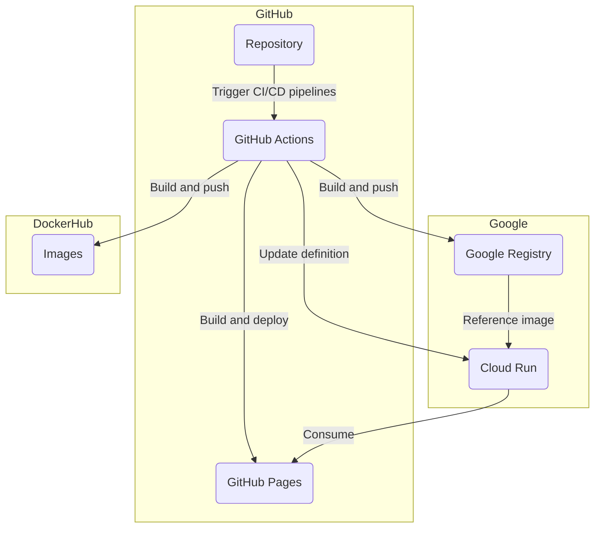

<!-- # running-routes -->
<header>

 
<a href="www.running-routes.com">running-routes</a> 

</header>

---
## Aim
* Create running routes to aid training (Melbourne Marathon 2022)
* Apply data science and optimisation techniques to geospatial data
* Contribute to the open-source and open-data community
* Learn some front-end dev

## Architecture
